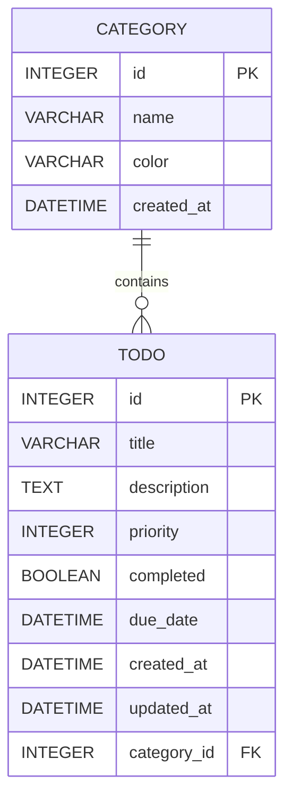

# Python 桌面待办清单应用设计方案

## 1. 技术选型

| 组件 | 技术 | 说明 |
|------|------|------|
| GUI 框架 | `tkinter` | Python 内置，无需额外安装 |
| 数据库 | `SQLite` | Python 内置，轻量级 |
| ORM | `SQLAlchemy` | 简化数据库操作 |
| 打包工具 | `PyInstaller` | 生成可执行文件 |

## 2. 数据库模型设计



### 表结构

#### categories 表
| 字段 | 类型 | 说明 |
|------|------|------|
| id | INTEGER PRIMARY KEY | 主键 |
| name | VARCHAR(50) | 分类名称 |
| color | VARCHAR(7) | 颜色代码 (如 #FF5733) |
| created_at | DATETIME | 创建时间 |

#### todos 表
| 字段 | 类型 | 说明 |
|------|------|------|
| id | INTEGER PRIMARY KEY | 主键 |
| title | VARCHAR(200) | 任务标题 |
| description | TEXT | 任务描述 |
| priority | INTEGER | 优先级 (1-高, 2-中, 3-低) |
| completed | BOOLEAN | 是否完成 |
| due_date | DATETIME | 截止日期 |
| created_at | DATETIME | 创建时间 |
| updated_at | DATETIME | 更新时间 |
| category_id | INTEGER | 外键，关联 categories |

## 3. 项目文件结构

```
todo-app/
├── main.py              # 程序入口
├── requirements.txt     # 依赖列表
├── database/
│   ├── __init__.py
│   ├── models.py        # SQLAlchemy 模型
│   └── db_manager.py    # 数据库操作封装
├── gui/
│   ├── __init__.py
│   ├── main_window.py   # 主窗口
│   ├── todo_list.py     # 待办列表组件
│   ├── todo_form.py     # 添加/编辑表单
│   └── category_dialog.py # 分类管理对话框
├── utils/
│   ├── __init__.py
│   └── validators.py    # 数据验证工具
└── config.py            # 配置文件
```

## 4. GUI 界面设计

### 主窗口布局
```
+--------------------------------------------------+
|  待办清单                                    [+] |
+--------------------------------------------------+
|  [筛选▼] [搜索...                    ] [刷新]   |
+--------------------------------------------------+
|                                                  |
|  +-----------------+  +-----------------------+ |
|  | 分类             |  | 任务列表               | |
|  |                  |  |                       | |
|  | ○ 全部          |  | ☑ 完成任务标题        | |
|  | ○ 工作          |  |   描述...     [高] [编辑]| |
|  | ○ 个人          |  |                       | |
|  | ○ 学习          |  | ☐ 未完成任务标题      | |
|  |                  |  |   描述...     [中] [编辑]| |
|  | [+ 添加分类]    |  |                       | |
|  +-----------------+  +-----------------------+ |
|                                                  |
|  状态栏: 共 10 项, 已完成 3 项, 待办 7 项        |
+--------------------------------------------------+
```

### 功能模块

| 模块 | 功能 |
|------|------|
| 任务管理 | 添加、编辑、删除、标记完成/未完成 |
| 分类管理 | 添加、编辑、删除分类，按分类筛选 |
| 搜索筛选 | 按关键词搜索，按状态/优先级/日期筛选 |
| 数据持久化 | SQLite 数据库存储 |

## 5. 实现步骤

### 第一阶段：基础架构
1. 创建项目目录结构
2. 配置虚拟环境
3. 安装依赖 (SQLAlchemy)
4. 编写配置文件

### 第二阶段：数据库层
1. 创建 SQLAlchemy 模型 (Category, Todo)
2. 实现数据库初始化
3. 封装 CRUD 操作

### 第三阶段：GUI 界面
1. 实现主窗口框架
2. 实现左侧分类面板
3. 实现右侧任务列表面板
4. 实现任务表单对话框
5. 实现分类管理对话框

### 第四阶段：功能集成
1. 连接数据库操作与界面
2. 实现筛选和搜索功能
3. 添加状态栏统计

### 第五阶段：优化完善
1. 添加输入验证
2. 错误处理
3. 界面美化
4. 打包可执行文件

## 6. 依赖列表

```
SQLAlchemy>=2.0.0
```

## 7. 运行方式

```bash
# 安装依赖
pip install -r requirements.txt

# 运行应用
python main.py
```
